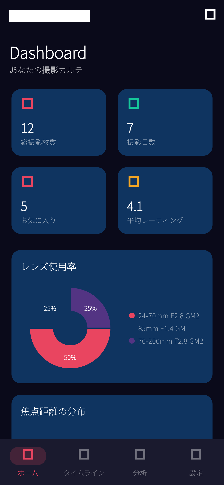
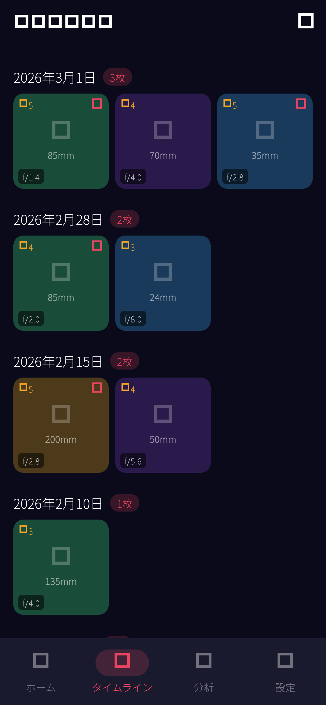
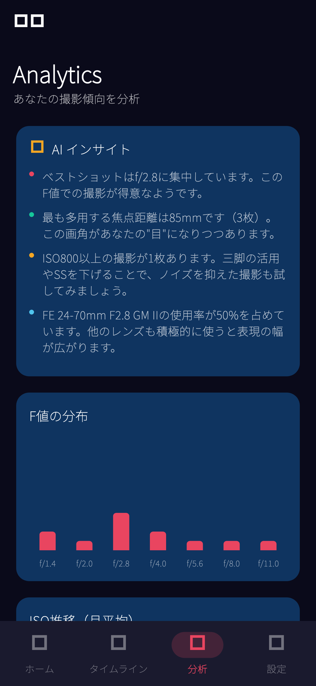
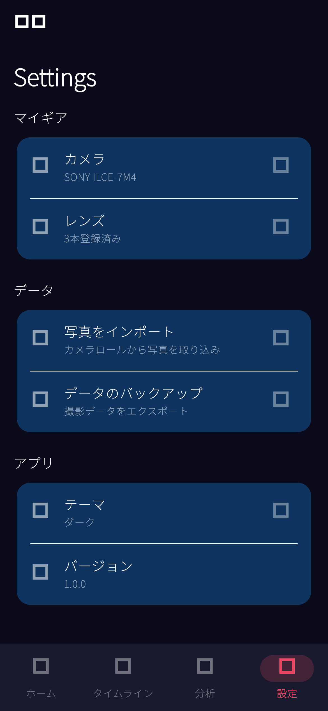

# ShotLog - 撮影カルテアプリ

一眼カメラで撮った写真のEXIFデータを自動解析し、撮影傾向を可視化。自分だけの「撮影カルテ」で成長を実感できるアプリ。

## スクリーンショット

| ホーム | タイムライン | 分析 | 設定 |
|:---:|:---:|:---:|:---:|
|  |  |  |  |

## 機能

- **ダッシュボード** - 総撮影枚数・撮影日数・お気に入り数・平均レーティングを一覧表示
- **レンズ使用率チャート** - どのレンズをどれだけ使っているか円グラフで可視化
- **焦点距離分布** - 広角〜望遠の使用頻度をバーチャートで表示
- **タイムライン** - 日付別の写真一覧（焦点距離・F値・レーティング表示）
- **AI インサイト** - 撮影傾向を分析し、改善ポイントをアドバイス
- **F値/ISO分析** - 設定値の分布と月次トレンドを可視化
- **レンズ別分析** - レンズごとの使用頻度・平均ISO・平均レーティング
- **写真詳細** - EXIF全情報表示、5段階レーティング、撮影メモ
- **設定** - マイギア管理、データインポート/バックアップ

## 技術スタック

| 要素 | 選定 |
|---|---|
| フレームワーク | Flutter 3.29 |
| 状態管理 | Riverpod |
| チャート | fl_chart |
| アーキテクチャ | Feature-first + Repository Pattern |

## セットアップ

```bash
git clone <repository-url>
cd snap-pj
flutter pub get
flutter run
```

## スクリーンショットの更新

```bash
flutter test --update-goldens test/screenshot_test.dart
```

## ディレクトリ構成

```
lib/
├── main.dart
├── app.dart
├── core/
│   └── theme/
│       └── app_theme.dart
├── features/
│   ├── home/           # ダッシュボード
│   ├── timeline/       # 写真一覧
│   ├── analytics/      # 分析
│   ├── photo_detail/   # 写真詳細
│   └── settings/       # 設定
└── shared/
    ├── models/         # データモデル・モックデータ
    ├── providers/      # Riverpod providers
    └── widgets/        # 共通ウィジェット
```

## ライセンス

MIT
